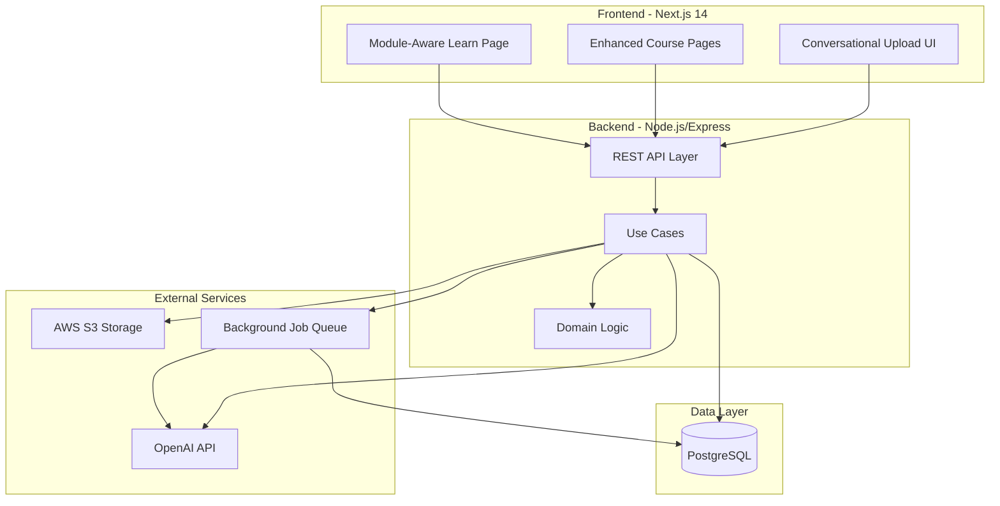
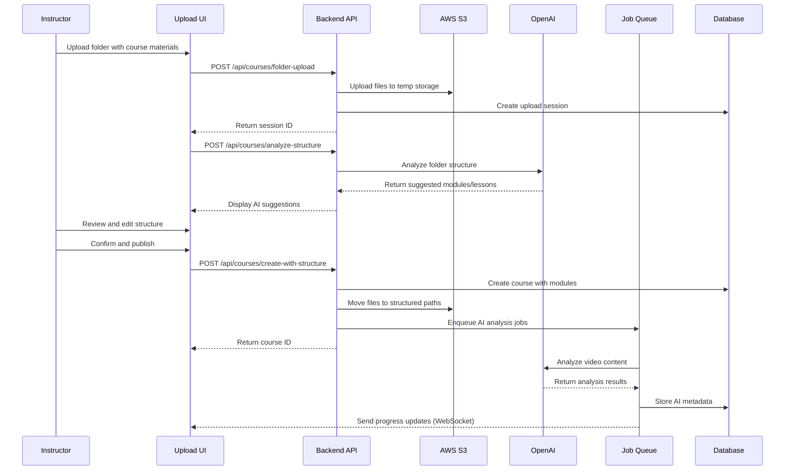

# Design Document: AI-Powered Course Creation System

## Overview

This design transforms the course creation experience from a traditional form-based upload into an intelligent, conversational system that guides instructors through the entire process. The system combines folder-based uploads with AI-powered content analysis to automatically organize course materials into structured modules and lessons. By leveraging OpenAI's API for content understanding and implementing a ChatGPT-style interface, we create an engaging experience that reduces friction while maintaining professional quality. The architecture extends the existing clean architecture pattern with new domain models for modules and lessons, implements a structured S3 storage hierarchy, and provides comprehensive CRUD operations for course management.

## Architecture

The system follows a clean architecture pattern with clear separation of concerns across presentation, application, domain, and infrastructure layers. The frontend uses Next.js 14 with App Router for the conversational UI, while the backend extends the existing Node.js/Express API with new endpoints for folder uploads, AI analysis, and module management.



## Main Workflow Sequence



## Components and Interfaces

### Frontend Components

#### 1. ConversationalUploadUI

**Purpose**: ChatGPT-style interface for course creation with real-time progress and AI guidance

**Interface**:

```typescript
interface ConversationalUploadUIProps {
  instructorId: string;
  onCourseCreated: (courseId: string) => void;
}

interface UploadMessage {
  id: string;
  role: "user" | "assistant" | "system";
  content: string;
  timestamp: Date;
  metadata?: {
    uploadProgress?: number;
    fileCount?: number;
    suggestedStructure?: CourseStructure;
  };
}
```

**Responsibilities**:

- Render chat-style message interface with smooth animations
- Handle folder drag-and-drop and file selection
- Display real-time upload progress with elegant UI
- Show AI-generated course structure suggestions
- Enable inline editing of modules and lessons
- Manage conversational flow state

#### 2. FolderUploadZone

**Purpose**: Drag-and-drop zone for folder uploads with visual feedback

**Interface**:

```typescript
interface FolderUploadZoneProps {
  onFilesSelected: (files: FileList) => void;
  acceptedTypes: string[];
  maxTotalSize: number;
}
```

**Responsibilities**:

- Accept folder uploads with nested structure
- Validate file types (MP4, MOV, AVI, PDF, JPG, PNG)
- Show visual feedback during drag operations
- Display file tree preview before upload

#### 3. ModuleEditor

**Purpose**: Interactive editor for course structure with drag-and-drop reordering

**Interface**:

```typescript
interface ModuleEditorProps {
  modules: CourseModule[];
  onModulesChange: (modules: CourseModule[]) => void;
  editable: boolean;
}

interface CourseModule {
  id: string;
  title: string;
  description?: string;
  order: number;
  lessons: CourseLesson[];
}

interface CourseLesson {
  id: string;
  moduleId: string;
  title: string;
  description?: string;
  order: number;
  type: "VIDEO" | "PDF" | "IMAGE";
  fileUrl?: string;
  duration?: number;
  aiAnalysis?: LessonAIAnalysis;
}
```

**Responsibilities**:

- Display module tree with expand/collapse
- Enable drag-and-drop reordering of modules and lessons
- Support inline editing of titles and descriptions
- Show lesson type icons and metadata
- Bulk operations (delete, reorder)

#### 4. AIAnalysisDisplay

**Purpose**: Show AI-generated insights and learning objectives

**Interface**:

```typescript
interface AIAnalysisDisplayProps {
  analysis: LessonAIAnalysis;
  lessonTitle: string;
}

interface LessonAIAnalysis {
  summary: string;
  topics: string[];
  learningObjectives: string[];
  keyPoints: string[];
  estimatedDifficulty?: "beginner" | "intermediate" | "advanced";
  transcription?: string;
}
```

**Responsibilities**:

- Display AI-generated summaries and topics
- Show learning objectives in readable format
- Indicate analysis status (pending, complete, failed)
- Provide fallback UI when analysis unavailable

### Backend Components

#### 5. FolderUploadService

**Purpose**: Handle folder uploads with nested structure preservation

**Interface**:

```typescript
interface FolderUploadService {
  uploadFolder(params: FolderUploadParams): Promise<UploadSession>;
  processFiles(sessionId: string): Promise<ProcessedFiles>;
  moveToStructuredStorage(
    sessionId: string,
    courseId: string,
    structure: CourseStructure
  ): Promise<void>;
}

interface FolderUploadParams {
  instructorId: string;
  files: UploadedFile[];
  folderStructure: FolderNode[];
}
```

**Responsibilities**:

- Accept multipart form data with folder structure
- Store files temporarily in S3 temp storage
- Preserve folder hierarchy metadata
- Generate unique session IDs for tracking
- Validate file types and sizes

#### 6. AIContentAnalyzer

**Purpose**: Analyze course content using OpenAI API

**Interface**:

```typescript
interface AIContentAnalyzer {
  analyzeStructure(files: FileMetadata[]): Promise<SuggestedStructure>;
  analyzeVideoContent(videoUrl: string, metadata: VideoMetadata): Promise<VideoAnalysis>;
  analyzePDFContent(pdfUrl: string): Promise<PDFAnalysis>;
  generateCourseSummary(modules: CourseModule[]): Promise<CourseSummary>;
}

interface SuggestedStructure {
  modules: Array<{
    title: string;
    description: string;
    order: number;
    lessons: Array<{
      title: string;
      type: AssetType;
      fileName: string;
      order: number;
    }>;
  }>;
  metadata: {
    suggestedName: string;
    suggestedDescription: string;
    suggestedCategory: string;
  };
}
```

**Responsibilities**:

- Call OpenAI API for content analysis
- Extract topics and learning objectives
- Generate summaries and descriptions
- Handle API rate limits and retries
- Cache analysis results

#### 7. ModuleRepository

**Purpose**: Database operations for modules and lessons

**Interface**:

```typescript
interface ModuleRepository {
  createModule(courseId: string, module: CreateModuleInput): Promise<Module>;
  updateModule(moduleId: string, updates: UpdateModuleInput): Promise<Module>;
  deleteModule(moduleId: string): Promise<void>;
  reorderModules(
    courseId: string,
    moduleOrders: Array<{ id: string; order: number }>
  ): Promise<void>;

  createLesson(moduleId: string, lesson: CreateLessonInput): Promise<Lesson>;
  updateLesson(lessonId: string, updates: UpdateLessonInput): Promise<Lesson>;
  deleteLesson(lessonId: string): Promise<void>;
  reorderLessons(
    moduleId: string,
    lessonOrders: Array<{ id: string; order: number }>
  ): Promise<void>;

  getModulesByCourse(courseId: string): Promise<Module[]>;
  getLessonsByModule(moduleId: string): Promise<Lesson[]>;
}
```

**Responsibilities**:

- CRUD operations for modules and lessons
- Maintain order consistency
- Handle cascading deletes
- Validate foreign key relationships
- Support bulk operations

#### 8. BackgroundJobProcessor

**Purpose**: Process AI analysis jobs asynchronously

**Interface**:

```typescript
interface BackgroundJobProcessor {
  enqueueAnalysis(job: AnalysisJob): Promise<string>;
  processJob(jobId: string): Promise<void>;
  getJobStatus(jobId: string): Promise<JobStatus>;
  cancelJob(jobId: string): Promise<void>;
}
```

**Responsibilities**:

- Queue AI analysis jobs for background processing
- Process jobs with retry logic
- Update database with analysis results
- Send progress notifications via WebSocket
- Handle job failures gracefully

## Data Models

### Database Schema

#### modules Table

```typescript
interface Module {
  id: string; // UUID primary key
  courseId: string; // Foreign key to courses
  title: string; // Module name
  description?: string; // Optional description
  order: number; // Display order (1-based)
  createdAt: Date;
  updatedAt: Date;
}

// Indexes:
// - PRIMARY KEY (id)
// - INDEX (courseId, order)
// - FOREIGN KEY (courseId) REFERENCES courses(id) ON DELETE CASCADE
```

#### lessons Table

```typescript
interface Lesson {
  id: string; // UUID primary key
  moduleId: string; // Foreign key to modules
  title: string; // Lesson name
  description?: string; // Optional description
  type: AssetType; // VIDEO, PDF, IMAGE, etc.
  order: number; // Display order within module
  assetId?: string; // Foreign key to course_assets
  duration?: number; // Duration in minutes (for videos)
  createdAt: Date;
  updatedAt: Date;
}
```

// Indexes:
// - PRIMARY KEY (id)
// - INDEX (moduleId, order)
// - FOREIGN KEY (moduleId) REFERENCES modules(id) ON DELETE CASCADE
// - FOREIGN KEY (assetId) REFERENCES course_assets(id) ON DELETE SET NULL

````

#### lesson_ai_analysis Table

```typescript
interface LessonAIAnalysis {
  id: string;                    // UUID primary key
  lessonId: string;              // Foreign key to lessons (unique)
  summary: string;               // AI-generated summary
  topics: string[];              // Array of key topics (JSONB)
  learningObjectives: string[];  // Array of learning objectives (JSONB)
  keyPoints: string[];           // Array of key points (JSONB)
  difficulty?: string;           // beginner, intermediate, advanced
  transcription?: string;        // Full video transcription (for videos)
  analyzedAt: Date;              // When analysis was completed
  createdAt: Date;
  updatedAt: Date;
}

// Indexes:
// - PRIMARY KEY (id)
// - UNIQUE INDEX (lessonId)
// - FOREIGN KEY (lessonId) REFERENCES lessons(id) ON DELETE CASCADE
// - GIN INDEX (topics) for array search
// - GIN INDEX (learningObjectives) for array search
````

#### Updated course_assets Table

```typescript
interface CourseAsset {
  id: string;
  courseId: string;
  assetType: AssetType;
  fileName: string;
  fileSize: number;
  storagePath: string; // New structured path
  mimeType: string;
  duration?: number;
  metadata?: Record<string, unknown>;
  createdAt: Date;
}
```

// New storagePath format:
// - courses/{courseId}/thumbnail.jpg
// - courses/{courseId}/modules/{moduleId}/videos/{lessonId}.mp4
// - courses/{courseId}/modules/{moduleId}/documents/{lessonId}.pdf
// - courses/{courseId}/modules/{moduleId}/images/{lessonId}.jpg

````

#### upload_sessions Table

```typescript
interface UploadSession {
  id: string;                    // UUID primary key
  instructorId: string;          // Foreign key to users
  status: 'uploading' | 'analyzing' | 'complete' | 'failed';
  fileCount: number;
  totalSize: number;
  folderStructure: FolderNode[]; // JSONB - original folder hierarchy
  tempStoragePaths: string[];    // JSONB - temp S3 paths
  suggestedStructure?: SuggestedStructure; // JSONB - AI suggestions
  createdAt: Date;
  updatedAt: Date;
  expiresAt: Date;               // Auto-cleanup after 24 hours
}

// Indexes:
// - PRIMARY KEY (id)
// - INDEX (instructorId, createdAt)
// - INDEX (expiresAt) for cleanup jobs
````

### TypeScript Types

```typescript
type AssetType = "VIDEO" | "PDF" | "IMAGE" | "QUIZ" | "EXAM" | "NOTE" | "OTHER";

interface FolderNode {
  name: string;
  path: string;
  type: "file" | "folder";
  children?: FolderNode[];
  fileType?: AssetType;
  size?: number;
}
```

interface CreateModuleInput {
title: string;
description?: string;
order: number;
}

interface UpdateModuleInput {
title?: string;
description?: string;
order?: number;
}

interface CreateLessonInput {
title: string;
description?: string;
type: AssetType;
order: number;
assetId?: string;
duration?: number;
}

interface UpdateLessonInput {
title?: string;
description?: string;
order?: number;
assetId?: string;
duration?: number;
}

````

## API Endpoints

### Folder Upload Endpoints

#### POST /api/courses/folder-upload

Upload entire folder with nested structure.

**Request**:
```typescript
// Multipart form data
{
  instructorId: string;
  files: File[];              // All files from folder
  folderStructure: string;    // JSON string of FolderNode[]
}
````

**Response**:

```typescript
{
  sessionId: string;
  fileCount: number;
  totalSize: number;
  tempStoragePaths: string[];
}
```

**Preconditions**:

- User is authenticated as instructor
- Total folder size < 10GB
- All files are supported types (MP4, MOV, AVI, PDF, JPG, PNG)

**Postconditions**:

- Files uploaded to temp S3 storage
- Upload session created in database
- Session expires after 24 hours

#### POST /api/courses/analyze-structure

Analyze uploaded files and suggest course structure.

**Request**:

```typescript
{
  sessionId: string;
}
```

**Response**:

```typescript
{
  suggestedStructure: {
    modules: Array<{
      title: string;
      description: string;
      order: number;
      lessons: Array<{
        title: string;
        type: AssetType;
        fileName: string;
        order: number;
      }>;
    }>;
    metadata: {
      suggestedName: string;
      suggestedDescription: string;
      suggestedCategory: string;
    }
  }
}
```

**Preconditions**:

- Valid session ID exists
- Session status is 'uploading' or 'analyzing'
- Files are uploaded to temp storage

**Postconditions**:

- AI analysis completed
- Suggested structure stored in session
- Session status updated to 'analyzing'

#### POST /api/courses/create-with-structure

Create course with modules and lessons from upload session.

**Request**:

```typescript
{
  sessionId: string;
  courseName: string;
  description: string;
  category: string;
  price: number;
  thumbnailUrl?: string;
  structure: {
    modules: Array<{
      title: string;
      description?: string;
      order: number;
      lessons: Array<{
        title: string;
        description?: string;
        type: AssetType;
        fileName: string;
        order: number;
      }>;
    }>;
  };
}
```

**Response**:

```typescript
{
  courseId: string;
  moduleCount: number;
  lessonCount: number;
  analysisJobIds: string[];
}
```

**Preconditions**:

- Valid session ID with uploaded files
- Course name is unique for instructor
- Structure matches uploaded files

**Postconditions**:

- Course created with DRAFT status
- Modules and lessons created in database
- Files moved from temp to structured S3 paths
- AI analysis jobs enqueued for each lesson
- Upload session marked complete

### Module Management Endpoints

#### GET /api/courses/:courseId/modules

Get all modules for a course with lessons.

**Response**:

```typescript
{
  modules: Array<{
    id: string;
    title: string;
    description?: string;
    order: number;
    lessons: Array<{
      id: string;
      title: string;
      description?: string;
      type: AssetType;
      order: number;
      duration?: number;
      assetUrl?: string;
      aiAnalysis?: {
        summary: string;
        topics: string[];
        learningObjectives: string[];
      };
    }>;
  }>;
}
```

#### POST /api/courses/:courseId/modules

Create a new module.

**Request**:

```typescript
{
  title: string;
  description?: string;
  order: number;
}
```

**Response**:

```typescript
{
  id: string;
  title: string;
  description?: string;
  order: number;
  createdAt: Date;
}
```

#### PATCH /api/modules/:moduleId

Update module details.

**Request**:

```typescript
{
  title?: string;
  description?: string;
  order?: number;
}
```

#### DELETE /api/modules/:moduleId

Delete module and all its lessons (cascade).

#### POST /api/courses/:courseId/modules/reorder

Reorder modules.

**Request**:

```typescript
{
  moduleOrders: Array<{
    id: string;
    order: number;
  }>;
}
```

### Lesson Management Endpoints

#### POST /api/modules/:moduleId/lessons

Create a new lesson.

**Request**:

```typescript
{
  title: string;
  description?: string;
  type: AssetType;
  order: number;
  assetId?: string;
  duration?: number;
}
```

#### PATCH /api/lessons/:lessonId

Update lesson details.

#### DELETE /api/lessons/:lessonId

Delete lesson.

#### POST /api/modules/:moduleId/lessons/reorder

Reorder lessons within a module.

### AI Analysis Endpoints

#### GET /api/lessons/:lessonId/analysis

Get AI analysis for a lesson.

**Response**:

```typescript
{
  summary: string;
  topics: string[];
  learningObjectives: string[];
  keyPoints: string[];
  difficulty?: string;
  transcription?: string;
  analyzedAt: Date;
}
```

#### POST /api/lessons/:lessonId/reanalyze

Trigger re-analysis of lesson content.

**Response**:

```typescript
{
  jobId: string;
  status: "queued";
}
```

## Algorithmic Pseudocode

### Main Course Creation Algorithm

```typescript
async function createCourseWithStructure(
  sessionId: string,
  courseData: CourseCreationData,
  structure: CourseStructure
): Promise<CourseCreationResult> {
  // Preconditions:
  // - sessionId exists and has status 'analyzing' or 'complete'
  // - courseData.name is non-empty and unique for instructor
  // - structure.modules is non-empty array
  // - All files referenced in structure exist in temp storage

  const session = await getUploadSession(sessionId);
  const transaction = await db.beginTransaction();

  try {
    // Step 1: Create course record
    const course = await createCourse({
      instructorId: session.instructorId,
      name: courseData.name,
      description: courseData.description,
      category: courseData.category,
      priceAmount: courseData.price,
      status: 'DRAFT',
      manifest: { modules: [] }
    }, transaction);
```

    // Step 2: Create modules and lessons
    const createdModules: Module[] = [];
    const analysisJobs: string[] = [];

    for (const moduleData of structure.modules) {
      // Create module
      const module = await createModule({
        courseId: course.id,
        title: moduleData.title,
        description: moduleData.description,
        order: moduleData.order
      }, transaction);

      createdModules.push(module);

      // Create lessons for this module
      for (const lessonData of moduleData.lessons) {
        // Find file in temp storage
        const tempFile = session.tempStoragePaths.find(
          path => path.includes(lessonData.fileName)
        );

        if (!tempFile) {
          throw new Error(`File not found: ${lessonData.fileName}`);
        }

        // Generate structured S3 path
        const structuredPath = generateStructuredPath(
          course.id,
          module.id,
          lessonData.type,
          lessonData.fileName
        );

        // Move file from temp to structured storage
        await s3.copyObject(tempFile, structuredPath);

        // Create asset record
        const asset = await createAsset({
          courseId: course.id,
          assetType: lessonData.type,
          fileName: lessonData.fileName,
          storagePath: structuredPath,
          fileSize: getFileSize(tempFile),
          mimeType: getMimeType(lessonData.fileName)
        }, transaction);

```


        // Create lesson
        const lesson = await createLesson({
          moduleId: module.id,
          title: lessonData.title,
          description: lessonData.description,
          type: lessonData.type,
          order: lessonData.order,
          assetId: asset.id,
          duration: lessonData.duration
        }, transaction);

        // Enqueue AI analysis job
        const jobId = await enqueueAnalysisJob({
          lessonId: lesson.id,
          assetUrl: structuredPath,
          assetType: lessonData.type
        });

        analysisJobs.push(jobId);
      }
    }

    // Step 3: Update course manifest
    await updateCourseManifest(course.id, {
      modules: createdModules.map(m => ({
        id: m.id,
        title: m.title,
        description: m.description,
        order: m.order,
        lessons: [] // Will be populated by query
      }))
    }, transaction);

    // Step 4: Clean up temp storage
    await deleteTemporaryFiles(session.tempStoragePaths);

    // Step 5: Mark session complete
    await updateUploadSession(sessionId, {
      status: 'complete'
    }, transaction);

    await transaction.commit();

    // Postconditions:
    // - Course created with DRAFT status
    // - All modules and lessons created
    // - Files moved to structured paths
    // - AI analysis jobs queued
    // - Temp files deleted

    return {
      courseId: course.id,
      moduleCount: createdModules.length,
      lessonCount: structure.modules.reduce((sum, m) => sum + m.lessons.length, 0),
      analysisJobIds: analysisJobs
    };
  } catch (error) {
    await transaction.rollback();
    throw error;
  }
}
```

### AI Content Analysis Algorithm

```typescript
async function analyzeVideoContent(
  videoUrl: string,
  metadata: VideoMetadata
): Promise<VideoAnalysis> {
  // Preconditions:
  // - videoUrl is accessible S3 URL
  // - Video file exists and is valid format
  // - OpenAI API key is configured

  try {
    // Step 1: Extract video metadata
    const duration = await getVideoDuration(videoUrl);
    const thumbnails = await extractThumbnails(videoUrl, [0.1, 0.5, 0.9]);

    // Step 2: Generate transcription (if video has audio)
    let transcription: string | undefined;
    if (metadata.hasAudio) {
      transcription = await openai.audio.transcriptions.create({
        file: await downloadVideoSegment(videoUrl),
        model: 'whisper-1'
      });
    }

    // Step 3: Analyze content with GPT-4
    const prompt = `Analyze this educational video content and provide:
1. A concise summary (2-3 sentences)
2. Key topics covered (3-5 topics)
3. Learning objectives (3-5 objectives)
4. Key points students should remember (5-7 points)
5. Difficulty level (beginner/intermediate/advanced)

Video title: ${metadata.title}
Duration: ${duration} minutes
${transcription ? `Transcription: ${transcription.substring(0, 2000)}...` : 'No audio transcription available'}

Return as JSON with keys: summary, topics, learningObjectives, keyPoints, difficulty`;

    const response = await openai.chat.completions.create({
      model: 'gpt-4-turbo-preview',
      messages: [
        {
          role: 'system',
          content: 'You are an educational content analyzer. Analyze video content and extract learning insights.'
        },
        {
          role: 'user',
          content: prompt
        }
      ],
      response_format: { type: 'json_object' },
      temperature: 0.3
    });
```

    const analysis = JSON.parse(response.choices[0].message.content);

    // Postconditions:
    // - Analysis contains all required fields
    // - Topics array has 3-5 items
    // - Learning objectives array has 3-5 items
    // - Difficulty is one of: beginner, intermediate, advanced

    return {
      summary: analysis.summary,
      topics: analysis.topics,
      learningObjectives: analysis.learningObjectives,
      keyPoints: analysis.keyPoints,
      difficulty: analysis.difficulty,
      transcription: transcription,
      analyzedAt: new Date()
    };

} catch (error) {
logger.error('Video analysis failed', { error, videoUrl });
throw new Error('Failed to analyze video content');
}
}

````

### Folder Structure Analysis Algorithm

```typescript
async function analyzeFolderStructure(
  files: FileMetadata[]
): Promise<SuggestedStructure> {
  // Preconditions:
  // - files array is non-empty
  // - All files have valid names and paths

  // Step 1: Build folder hierarchy
  const hierarchy = buildFolderHierarchy(files);

  // Step 2: Detect module patterns
  const modulePatterns = [
    /module[_\s-]?(\d+)/i,
    /week[_\s-]?(\d+)/i,
    /section[_\s-]?(\d+)/i,
    /chapter[_\s-]?(\d+)/i,
    /lesson[_\s-]?(\d+)/i
  ];

  const detectedModules: Map<string, FileMetadata[]> = new Map();

  for (const file of files) {
    let moduleKey = 'uncategorized';

    // Check folder path for module patterns
    for (const pattern of modulePatterns) {
      const match = file.path.match(pattern);
      if (match) {
        moduleKey = match[0];
        break;
      }
    }

    if (!detectedModules.has(moduleKey)) {
      detectedModules.set(moduleKey, []);
    }
    detectedModules.get(moduleKey)!.push(file);
  }
````

// Step 3: Use AI to refine structure
const fileList = files.map(f => f.path).join('\n');

const prompt = `Analyze this course folder structure and organize it into logical modules.

Files:
${fileList}

Detected patterns: ${Array.from(detectedModules.keys()).join(', ')}

Create a well-organized course structure with:

- 3-8 modules (logical groupings)
- Clear, descriptive module titles
- Lessons ordered logically within each module
- Suggested course name, description, and category

Return JSON with structure: { modules: [...], metadata: {...} }`;

const response = await openai.chat.completions.create({
model: 'gpt-4-turbo-preview',
messages: [
{
role: 'system',
content: 'You are a course structure expert. Organize files into logical learning modules.'
},
{
role: 'user',
content: prompt
}
],
response_format: { type: 'json_object' },
temperature: 0.5
});

const suggestedStructure = JSON.parse(response.choices[0].message.content);

// Postconditions:
// - Structure has 3-8 modules
// - Each module has at least 1 lesson
// - All files are assigned to a module
// - Metadata includes course name, description, category

return suggestedStructure;
}

````

## UI/UX Design

### Conversational Upload Flow

The upload experience follows a ChatGPT-style conversational pattern:

1. **Welcome Message**: AI greets instructor and explains the process
2. **Folder Upload**: Instructor drags folder or clicks to browse
3. **Upload Progress**: Real-time progress with file count and size
4. **AI Analysis**: "Analyzing your course structure..." with animated loader
5. **Structure Preview**: AI presents suggested modules and lessons
6. **Interactive Editing**: Instructor can rename, reorder, or reorganize
7. **Metadata Collection**: AI asks for course details conversationally
8. **Publishing**: Final confirmation and background processing
9. **Success**: Course created with link to edit or view

### Animation Guidelines (Framer Motion)

```typescript
// Message entrance animation
const messageVariants = {
  hidden: { opacity: 0, y: 20 },
  visible: {
    opacity: 1,
    y: 0,
    transition: { duration: 0.3, ease: 'easeOut' }
  }
};

// Upload progress animation
const progressVariants = {
  initial: { width: 0 },
  animate: (progress: number) => ({
    width: `${progress}%`,
    transition: { duration: 0.5, ease: 'easeInOut' }
  })
};

// Module card animation
const moduleCardVariants = {
  hidden: { opacity: 0, scale: 0.95 },
  visible: (i: number) => ({
    opacity: 1,
    scale: 1,
    transition: {
      delay: i * 0.1,
      duration: 0.3,
      ease: 'easeOut'
    }
  })
};

// Drag and drop animation
const dragVariants = {
  idle: { scale: 1 },
  hover: { scale: 1.02, transition: { duration: 0.2 } },
  dragging: { scale: 1.05, boxShadow: '0 10px 30px rgba(0,0,0,0.2)' }
};
````

### Responsive Design Breakpoints

```typescript
const breakpoints = {
  mobile: "0px", // 0-767px
  tablet: "768px", // 768-1023px
  desktop: "1024px", // 1024-1439px
  wide: "1440px", // 1440px+
};

// Mobile: Single column, stacked layout
// Tablet: Two columns for module grid
// Desktop: Three columns, sidebar for chat
// Wide: Four columns, expanded workspace
```

## S3 Storage Strategy

### Structured Path Format

```
courses/{courseId}/
  thumbnail.jpg                                    # Course thumbnail
  modules/{moduleId}/
    videos/{lessonId}.mp4                         # Video lessons
    videos/{lessonId}_thumbnail.jpg               # Video thumbnails
    documents/{lessonId}.pdf                      # PDF documents
    images/{lessonId}.jpg                         # Image resources

temp-uploads/{instructorId}/{sessionId}/
  {uuid}.mp4                                      # Temporary storage
  {uuid}.pdf                                      # Deleted after 24 hours
```

### Migration Strategy

For existing courses with old structure (`instructorId/unassigned/uuid.mp4`):

```typescript
async function migrateExistingCourse(courseId: string): Promise<void> {
  // 1. Get all assets for course
  const assets = await getAssetsByCourse(courseId);

  // 2. Create default module if none exist
  let defaultModule = await getModulesByCourse(courseId);
  if (defaultModule.length === 0) {
    defaultModule = [
      await createModule({
        courseId,
        title: "Course Content",
        description: "Main course materials",
        order: 1,
      }),
    ];
  }

  // 3. For each asset, create lesson and move file
  for (const asset of assets) {
    const newPath = generateStructuredPath(
      courseId,
      defaultModule[0].id,
      asset.assetType,
      asset.fileName
    );

    // Copy to new location
    await s3.copyObject(asset.storagePath, newPath);

    // Create lesson
    await createLesson({
      moduleId: defaultModule[0].id,
      title: extractTitleFromFilename(asset.fileName),
      type: asset.assetType,
      order: assets.indexOf(asset) + 1,
      assetId: asset.id,
    });

    // Update asset path
    await updateAsset(asset.id, { storagePath: newPath });

    // Delete old file
    await s3.deleteObject(asset.storagePath);
  }
}
```

## Background Job Processing

### Job Queue Architecture

```typescript
interface AnalysisJob {
  id: string;
  type: "video_analysis" | "pdf_analysis" | "course_summary";
  lessonId: string;
  assetUrl: string;
  assetType: AssetType;
  status: "queued" | "processing" | "completed" | "failed";
  retryCount: number;
  maxRetries: number;
  createdAt: Date;
  startedAt?: Date;
  completedAt?: Date;
  error?: string;
}

// Job processing with retry logic
async function processAnalysisJob(job: AnalysisJob): Promise<void> {
  try {
    await updateJobStatus(job.id, "processing");

    let analysis: LessonAIAnalysis;

    if (job.assetType === "VIDEO") {
      analysis = await analyzeVideoContent(job.assetUrl, {
        title: await getLessonTitle(job.lessonId),
        hasAudio: true,
      });
    } else if (job.assetType === "PDF") {
      analysis = await analyzePDFContent(job.assetUrl);
    } else {
      throw new Error(`Unsupported asset type: ${job.assetType}`);
    }

    // Store analysis results
    await storeLessonAnalysis(job.lessonId, analysis);

    // Update job status
    await updateJobStatus(job.id, "completed");

    // Notify via WebSocket
    await notifyAnalysisComplete(job.lessonId);
  } catch (error) {
    logger.error("Job processing failed", { jobId: job.id, error });

    if (job.retryCount < job.maxRetries) {
      // Retry with exponential backoff
      const delay = Math.pow(2, job.retryCount) * 1000;
      await scheduleRetry(job.id, delay);
    } else {
      await updateJobStatus(job.id, "failed", error.message);
    }
  }
}
```

## Error Handling

### Error Scenarios

#### 1. Upload Failures

**Condition**: Network interruption during folder upload
**Response**:

- Pause upload and show retry button
- Resume from last successful chunk
- Display clear error message with retry option

**Recovery**:

- Implement chunked uploads with resume capability
- Store upload progress in session
- Auto-retry with exponential backoff

#### 2. AI Analysis Failures

**Condition**: OpenAI API rate limit or timeout
**Response**:

- Mark analysis as pending
- Queue for retry with backoff
- Show "Analysis in progress" in UI

**Recovery**:

- Retry up to 3 times with increasing delays
- Fall back to basic metadata if AI fails
- Allow manual re-trigger of analysis

#### 3. Invalid Folder Structure

**Condition**: No supported files in uploaded folder
**Response**:

- Show friendly error message
- List supported file types
- Suggest folder structure examples

**Recovery**:

- Allow user to upload different folder
- Provide folder structure guidelines
- Validate before starting upload

#### 4. Storage Quota Exceeded

**Condition**: Instructor exceeds storage limit
**Response**:

- Block upload with clear message
- Show current usage and limit
- Suggest upgrade or cleanup options

**Recovery**:

- Implement storage quota checks before upload
- Provide storage management tools
- Offer upgrade path

#### 5. Duplicate Course Names

**Condition**: Course name already exists for instructor
**Response**:

- Show validation error in real-time
- Suggest alternative names
- Allow editing before submission

**Recovery**:

- Validate course name on blur
- Provide instant feedback
- Auto-suggest unique variations

## Testing Strategy

### Unit Testing Approach

Test individual components and functions in isolation:

```typescript
// Example: Module creation validation
describe("createModule", () => {
  it("should create module with valid data", async () => {
    const module = await createModule({
      courseId: "course-123",
      title: "Introduction",
      order: 1,
    });

    expect(module.id).toBeDefined();
    expect(module.title).toBe("Introduction");
    expect(module.order).toBe(1);
  });

  it("should reject empty title", async () => {
    await expect(
      createModule({
        courseId: "course-123",
        title: "",
        order: 1,
      })
    ).rejects.toThrow("Title is required");
  });

  it("should enforce unique order per course", async () => {
    await createModule({
      courseId: "course-123",
      title: "Module 1",
      order: 1,
    });

    await expect(
      createModule({
        courseId: "course-123",
        title: "Module 2",
        order: 1,
      })
    ).rejects.toThrow("Order already exists");
  });
});
```

**Coverage Goals**:

- Domain logic: 90%+
- Use cases: 85%+
- API endpoints: 80%+
- UI components: 75%+

### Property-Based Testing Approach

Use property-based testing for complex algorithms and data transformations:

**Property Test Library**: fast-check (for TypeScript/JavaScript)

```typescript
import fc from "fast-check";

// Property: Module reordering preserves all modules
describe("reorderModules property tests", () => {
  it("should preserve all module IDs after reordering", () => {
    fc.assert(
      fc.property(
        fc.array(
          fc.record({
            id: fc.uuid(),
            order: fc.integer({ min: 1, max: 100 }),
          }),
          { minLength: 1, maxLength: 20 }
        ),
        async (modules) => {
          const originalIds = modules.map((m) => m.id).sort();

          const reordered = await reorderModules(
            "course-123",
            modules.map((m, i) => ({ id: m.id, order: i + 1 }))
          );

          const reorderedIds = reordered.map((m) => m.id).sort();

          expect(reorderedIds).toEqual(originalIds);
        }
      )
    );
  });

  // Property: Order values are sequential after reordering
  it("should produce sequential order values", () => {
    fc.assert(
      fc.property(fc.array(fc.uuid(), { minLength: 1, maxLength: 20 }), async (moduleIds) => {
        const reordered = await reorderModules(
          "course-123",
          moduleIds.map((id, i) => ({ id, order: i + 1 }))
        );

        const orders = reordered.map((m) => m.order).sort((a, b) => a - b);

        for (let i = 0; i < orders.length; i++) {
          expect(orders[i]).toBe(i + 1);
        }
      })
    );
  });
});
```

```typescript
// Property: Folder structure analysis always produces valid structure
describe("analyzeFolderStructure property tests", () => {
  it("should always produce valid module structure", () => {
    fc.assert(
      fc.property(
        fc.array(
          fc.record({
            name: fc.string({ minLength: 1, maxLength: 50 }),
            path: fc.string({ minLength: 1, maxLength: 200 }),
            type: fc.constantFrom("VIDEO", "PDF", "IMAGE"),
          }),
          { minLength: 1, maxLength: 50 }
        ),
        async (files) => {
          const structure = await analyzeFolderStructure(files);

          // Property 1: Has at least one module
          expect(structure.modules.length).toBeGreaterThan(0);

          // Property 2: All modules have lessons
          for (const module of structure.modules) {
            expect(module.lessons.length).toBeGreaterThan(0);
          }

          // Property 3: All files are assigned
          const assignedFiles = structure.modules.flatMap((m) => m.lessons.map((l) => l.fileName));
          expect(assignedFiles.length).toBe(files.length);

          // Property 4: Orders are sequential
          const moduleOrders = structure.modules.map((m) => m.order).sort();
          for (let i = 0; i < moduleOrders.length; i++) {
            expect(moduleOrders[i]).toBe(i + 1);
          }
        }
      )
    );
  });
});
```

### Integration Testing Approach

Test complete workflows end-to-end:

```typescript
describe("Course creation workflow integration", () => {
  it("should create course from folder upload to published", async () => {
    // 1. Upload folder
    const uploadResponse = await request(app)
      .post("/api/courses/folder-upload")
      .attach("files", "test/fixtures/module1/video1.mp4")
      .attach("files", "test/fixtures/module1/video2.mp4")
      .field("instructorId", "instructor-123")
      .field("folderStructure", JSON.stringify(testFolderStructure));

    expect(uploadResponse.status).toBe(200);
    const { sessionId } = uploadResponse.body;

    // 2. Analyze structure
    const analyzeResponse = await request(app)
      .post("/api/courses/analyze-structure")
      .send({ sessionId });

    expect(analyzeResponse.status).toBe(200);
    expect(analyzeResponse.body.suggestedStructure.modules).toBeDefined();

    // 3. Create course
    const createResponse = await request(app).post("/api/courses/create-with-structure").send({
      sessionId,
      courseName: "Test Course",
      description: "Test Description",
      category: "Programming",
      price: 49.99,
      structure: analyzeResponse.body.suggestedStructure,
    });

    expect(createResponse.status).toBe(201);
    const { courseId } = createResponse.body;

    // 4. Verify course structure
    const courseResponse = await request(app).get(`/api/courses/${courseId}/modules`);

    expect(courseResponse.status).toBe(200);
    expect(courseResponse.body.modules.length).toBeGreaterThan(0);

    // 5. Verify S3 files moved
    const modules = courseResponse.body.modules;
    for (const module of modules) {
      for (const lesson of module.lessons) {
        const exists = await s3FileExists(lesson.assetUrl);
        expect(exists).toBe(true);
      }
    }
  });
});
```

## Performance Considerations

### Upload Performance

**Challenge**: Large folder uploads (up to 10GB) can be slow

**Optimizations**:

- Chunked multipart uploads (100MB chunks)
- Parallel upload of multiple files (max 3 concurrent)
- S3 Transfer Acceleration for faster uploads
- Client-side compression for PDFs and images
- Resume capability for interrupted uploads

**Metrics**:

- Target: 50MB/s upload speed with acceleration
- Chunk size: 100MB for optimal throughput
- Timeout: 5 minutes per chunk
- Max concurrent uploads: 3 files

### AI Analysis Performance

**Challenge**: Video analysis can take 2-5 minutes per video

**Optimizations**:

- Background job processing with queue
- Batch processing of multiple videos
- Cache analysis results to avoid re-processing
- Progressive disclosure (show partial results)
- Parallel processing of independent videos

**Metrics**:

- Target: 2 minutes per 10-minute video
- Queue throughput: 10 videos per minute
- Max concurrent jobs: 5
- Retry delay: Exponential backoff (1s, 2s, 4s)

### Database Performance

**Challenge**: Complex queries for nested module/lesson structures

**Optimizations**:

- Composite indexes on (courseId, order)
- Eager loading of related data
- Query result caching (5 minutes TTL)
- Denormalized manifest in course table
- Batch inserts for bulk operations

**Indexes**:

```sql
CREATE INDEX idx_modules_course_order ON modules(course_id, order);
CREATE INDEX idx_lessons_module_order ON lessons(module_id, order);
CREATE INDEX idx_lesson_analysis_lesson ON lesson_ai_analysis(lesson_id);
CREATE INDEX idx_assets_course ON course_assets(course_id);
```

### Frontend Performance

**Challenge**: Rendering large course structures with animations

**Optimizations**:

- Virtual scrolling for long lesson lists
- Lazy loading of module content
- Debounced search and filter operations
- Optimistic UI updates for instant feedback
- Code splitting for upload components

**Metrics**:

- Initial load: < 2 seconds
- Time to interactive: < 3 seconds
- Animation frame rate: 60 FPS
- Bundle size: < 500KB (gzipped)

## Security Considerations

### File Upload Security

**Threats**:

- Malicious file uploads (malware, scripts)
- Oversized files causing DoS
- Unauthorized access to uploaded files

**Mitigations**:

- File type validation (whitelist: MP4, MOV, AVI, PDF, JPG, PNG)
- File size limits (10GB total, 5GB per file)
- Virus scanning on upload (ClamAV integration)
- Signed URLs with expiration for S3 access
- Rate limiting on upload endpoints

**Implementation**:

```typescript
// File validation
const ALLOWED_MIME_TYPES = [
  "video/mp4",
  "video/quicktime",
  "video/x-msvideo",
  "application/pdf",
  "image/jpeg",
  "image/png",
];

const MAX_FILE_SIZE = 5 * 1024 * 1024 * 1024; // 5GB
const MAX_TOTAL_SIZE = 10 * 1024 * 1024 * 1024; // 10GB

function validateFile(file: File): ValidationResult {
  if (!ALLOWED_MIME_TYPES.includes(file.type)) {
    return { valid: false, error: "File type not allowed" };
  }

  if (file.size > MAX_FILE_SIZE) {
    return { valid: false, error: "File too large" };
  }

  return { valid: true };
}
```

### API Security

**Threats**:

- Unauthorized course modification
- Data injection attacks
- API abuse and rate limiting

**Mitigations**:

- JWT authentication on all endpoints
- Role-based access control (instructor only)
- Input validation and sanitization
- SQL injection prevention (parameterized queries)
- Rate limiting (100 requests per minute)
- CSRF protection

**Authorization Rules**:

```typescript
// Only course owner can modify
async function authorizeModuleOperation(
  userId: string,
  moduleId: string,
  operation: "read" | "write" | "delete"
): Promise<boolean> {
  const module = await getModule(moduleId);
  const course = await getCourse(module.courseId);

  if (course.instructorId !== userId) {
    throw new UnauthorizedError("Not course owner");
  }

  return true;
}
```

### Data Privacy

**Concerns**:

- Student viewing data privacy
- Instructor content protection
- AI analysis data retention

**Protections**:

- Encrypted data at rest (S3 server-side encryption)
- Encrypted data in transit (HTTPS/TLS)
- Access logs for audit trail
- GDPR compliance (data deletion on request)
- AI analysis data anonymization

## Dependencies

### Frontend Dependencies

```json
{
  "dependencies": {
    "next": "^14.0.0",
    "react": "^18.2.0",
    "framer-motion": "^10.16.0",
    "react-dropzone": "^14.2.3",
    "@tanstack/react-query": "^5.0.0",
    "@dnd-kit/core": "^6.0.8",
    "@dnd-kit/sortable": "^7.0.2",
    "socket.io-client": "^4.6.0"
  }
}
```

### Backend Dependencies

```json
{
  "dependencies": {
    "express": "^4.18.0",
    "pg": "^8.11.0",
    "@aws-sdk/client-s3": "^3.450.0",
    "openai": "^4.20.0",
    "multer": "^1.4.5-lts.1",
    "bull": "^4.11.0",
    "socket.io": "^4.6.0",
    "zod": "^3.22.0"
  }
}
```

### External Services

- **AWS S3**: File storage with Transfer Acceleration
- **OpenAI API**: GPT-4 Turbo for content analysis, Whisper for transcription
- **Redis**: Job queue and caching
- **PostgreSQL**: Primary database with JSONB support
- **WebSocket**: Real-time progress updates

### Infrastructure Requirements

- **Compute**: Node.js 18+ runtime
- **Memory**: 2GB minimum for API server, 4GB for job workers
- **Storage**: S3 bucket with versioning enabled
- **Database**: PostgreSQL 14+ with JSONB support
- **Cache**: Redis 6+ for job queue
- **Network**: CDN for static assets, S3 Transfer Acceleration

## Implementation Approach

### Phase 1: Database Schema (Week 1)

1. Create migration scripts for new tables
2. Add indexes for performance
3. Update existing course repository
4. Test data integrity and relationships

### Phase 2: Backend API (Week 2-3)

1. Implement folder upload endpoint
2. Build AI analysis service
3. Create module/lesson CRUD endpoints
4. Set up background job processing
5. Implement S3 structured storage
6. Add WebSocket for real-time updates

### Phase 3: Frontend UI (Week 3-4)

1. Build conversational upload interface
2. Implement folder drag-and-drop
3. Create module editor component
4. Add AI analysis display
5. Implement animations with Framer Motion
6. Make responsive for all devices

### Phase 4: Integration & Testing (Week 5)

1. End-to-end workflow testing
2. Performance optimization
3. Security audit
4. User acceptance testing
5. Bug fixes and polish

### Phase 5: Migration & Deployment (Week 6)

1. Migrate existing courses to new structure
2. Deploy to staging environment
3. Load testing and monitoring
4. Production deployment
5. Documentation and training

## Correctness Properties

_A property is a characteristic or behavior that should hold true across all valid executions of a system—essentially, a formal statement about what the system should do. Properties serve as the bridge between human-readable specifications and machine-verifiable correctness guarantees._

### Property 1: Folder Structure Preservation

_For any_ uploaded folder with nested structure, the system should preserve the complete hierarchy including all folder names, file names, and parent-child relationships in the Upload_Session.

**Validates: Requirements 1.1, 1.6**

### Property 2: File Type Whitelist Enforcement

_For any_ uploaded file, the system should accept it if and only if its MIME type is in the whitelist (video/mp4, video/quicktime, video/x-msvideo, application/pdf, image/jpeg, image/png).

**Validates: Requirements 1.4, 12.1, 12.2**

### Property 3: Size Limit Enforcement

_For any_ upload operation, the system should reject it if any individual file exceeds 5GB or if the total session size exceeds 10GB.

**Validates: Requirements 1.5, 12.3, 12.4**

### Property 4: Upload Session Expiration

_For any_ Upload_Session created, the expiresAt timestamp should equal createdAt plus exactly 24 hours.

**Validates: Requirements 1.3, 14.1**

### Property 5: Complete File Assignment

_For any_ AI-suggested course structure, every uploaded file should be assigned to exactly one lesson in exactly one module (no files left unassigned, no files assigned multiple times).

**Validates: Requirements 2.7, 5.4**

### Property 6: Module Count Range

_For any_ AI structure analysis, the suggested structure should contain between 3 and 8 modules inclusive.

**Validates: Requirement 2.3**

### Property 7: Analysis Metadata Completeness

_For any_ completed AI structure analysis, the result should include non-empty values for course name, description, and category.

**Validates: Requirement 2.5**

### Property 8: Sequential Module Ordering

_For any_ course with n modules, the module order values should form a complete sequence [1, 2, 3, ..., n] with no gaps or duplicates.

**Validates: Requirements 5.2, 5.6, 7.3, 7.6**

### Property 9: Sequential Lesson Ordering

_For any_ module with n lessons, the lesson order values within that module should form a complete sequence [1, 2, 3, ..., n] with no gaps or duplicates.

**Validates: Requirements 5.3, 5.7, 8.3, 8.7**

### Property 10: Structured Path Format

_For any_ asset created for a lesson, the storagePath should match the pattern `courses/{courseId}/modules/{moduleId}/{type}/{lessonId}.{ext}` where type is "videos", "documents", or "images" based on asset type.

**Validates: Requirements 5.5, 13.1, 13.2, 13.3, 13.4, 13.6**

### Property 11: Storage Path Uniqueness

_For any_ two distinct assets in the system, their storagePath values should be different.

**Validates: Requirements 13.7**

### Property 12: Temporary File Cleanup

_For any_ successfully created course, all temporary files from the associated Upload_Session should be deleted from S3.

**Validates: Requirement 5.8**

### Property 13: Analysis Job Creation

_For any_ course created with n video lessons and m PDF lessons, exactly (n + m) Analysis_Jobs should be enqueued.

**Validates: Requirement 6.1**

### Property 14: Analysis Result Completeness

_For any_ completed video Analysis_Job, the stored result should contain non-empty values for summary, topics array, learningObjectives array, keyPoints array, and difficulty level.

**Validates: Requirements 6.3, 6.5**

### Property 15: Job Retry with Exponential Backoff

_For any_ failed Analysis_Job, if retryCount < 3, the job should be retried with delay = 2^retryCount seconds (1s, 2s, 4s).

**Validates: Requirements 6.6, 18.2**

### Property 16: Reorder Preservation

_For any_ reorder operation on modules or lessons, the set of IDs after reordering should equal the set of IDs before reordering (no items lost or duplicated).

**Validates: Requirements 7.3, 8.3**

### Property 17: Cascade Deletion Completeness

_For any_ deleted course, all associated modules, lessons, assets, and AI analysis records should also be deleted from the database.

**Validates: Requirements 7.4, 7.5, 8.5, 8.6, 20.1, 20.2**

### Property 18: Referential Integrity

_For any_ lesson in the system, there should exist a module with id = lesson.moduleId, and for that module, there should exist a course with id = module.courseId.

**Validates: Requirements 20.3, 20.4, 20.5**

### Property 19: Course Duration Calculation

_For any_ course, the displayed total duration should equal the sum of all video lesson durations across all modules.

**Validates: Requirement 10.6**

### Property 20: Lesson Count Calculation

_For any_ course, the displayed total lesson count should equal the sum of lesson counts across all modules.

**Validates: Requirements 10.2, 10.7**

### Property 21: Progress Percentage Calculation

_For any_ student's course progress, the displayed percentage should equal (number of completed lessons / total lessons) × 100.

**Validates: Requirement 11.7**

### Property 22: Cross-Module Navigation

_For any_ lesson that is not the last lesson in the course, clicking "Next" should navigate to either the next lesson in the same module or the first lesson of the next module.

**Validates: Requirement 11.5**

### Property 23: Signed URL Expiration

_For any_ generated S3 signed URL, the expiration time should be exactly 1 hour from generation time.

**Validates: Requirement 12.5**

### Property 24: Rate Limiting Enforcement

_For any_ instructor making upload requests, if more than 100 requests are made within a 1-minute window, subsequent requests should be rejected with a 429 status code.

**Validates: Requirement 12.6**

### Property 25: Authorization Verification

_For any_ module or lesson modification request, the system should verify that the requesting instructor's ID matches the course's instructorId before allowing the operation.

**Validates: Requirements 16.1, 16.2**

### Property 26: Student Access Control

_For any_ course with status DRAFT, student access requests should be rejected, and for any course with status PUBLISHED, student access should be allowed.

**Validates: Requirements 16.5, 16.6**

### Property 27: Upload Chunk Size

_For any_ file upload larger than 100MB, the file should be split into chunks of exactly 100MB (except the final chunk which may be smaller).

**Validates: Requirement 19.1**

### Property 28: Concurrent Upload Limit

_For any_ point in time during folder upload, at most 3 files should be uploading simultaneously.

**Validates: Requirements 1.7, 19.2**

### Property 29: Concurrent Job Processing Limit

_For any_ point in time during background processing, at most 5 Analysis_Jobs should be in 'processing' status simultaneously.

**Validates: Requirement 19.5**

### Property 30: Transaction Atomicity

_For any_ multi-record operation (course creation, module deletion, etc.), either all database changes should succeed or all should be rolled back, with no partial state.

**Validates: Requirements 18.5, 20.7**

These properties ensure data integrity, consistency, and correctness throughout the system lifecycle.
